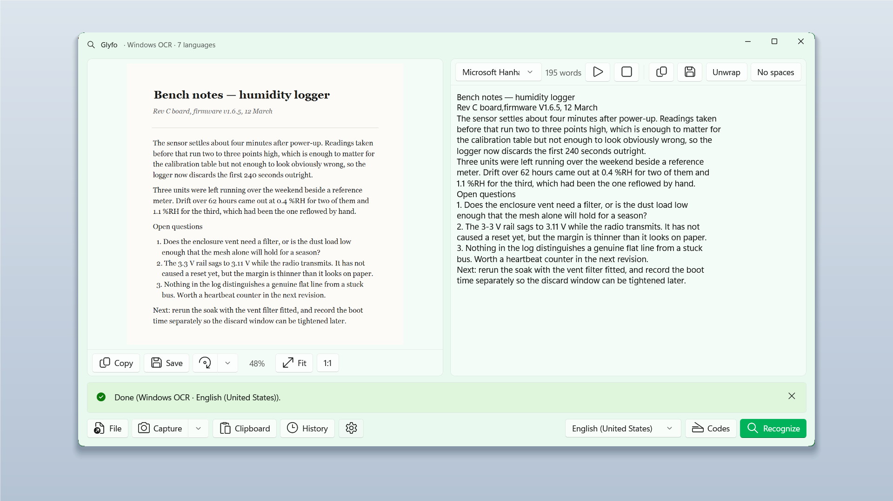

# Glyfo

**Turns any text on your screen into text you can use — entirely on your machine, with no network
connections.**

Press <kbd>Alt</kbd>+<kbd>Z</kbd>, frame part of the screen, and the text is beside it — ready to
copy, hear read aloud, or clean up. Glyfo reads QR codes and barcodes out of the same image, and on a
Copilot+ PC it translates the result too.

Free. No ads, no in-app purchases, no account.

## Glyfo makes no network connections

Not "your data is safe with us" — there is no server to send it to. Recognition runs on the Windows
OCR engine that is already on your machine. On a Copilot+ PC, Glyfo additionally uses the on-device
text-recognition model for difficult images and can translate the result, still without a network.

## Four ways to get an image in

| | |
|---|---|
| <kbd>Alt</kbd>+<kbd>Z</kbd> | Frame any part of the screen. <kbd>Ctrl</kbd>+<kbd>Shift</kbd>+<kbd>R</kbd> takes the whole screen. |
| <kbd>Ctrl</kbd>+<kbd>V</kbd> | Paste an image from the clipboard — or text, which works too. |
| <kbd>Ctrl</kbd>+<kbd>O</kbd> | Open a file, or drag one into the window. |
| Share | Right-click an image in Explorer and open it with Glyfo, or send it from the Windows share sheet (Photos, Snipping Tool, your browser). |

## What you get back

- The recognized text beside the image, in the order it was laid out.
- One-click copy, or let a capture copy itself the moment it is ready.
- Read aloud with any voice installed on the machine.
- **Remove line breaks** puts paragraphs back together; **Remove spaces** strips the gaps.
- QR codes and barcodes read from the same image.
- Translation on Copilot+ PCs, on-device.
- History, so a capture from ten minutes ago is still there.
- Runs from the tray — close the window and the hotkey keeps working.

## Doesn't PowerToys already do this?

PowerToys Text Extractor grabs text from a screen region, and it is good at that. Glyfo also takes
files, clipboard pastes and Windows Share; reads QR codes and barcodes; speaks the result aloud;
translates it; keeps a history; unwraps and de-spaces the text; and its own interface is localized
into 33 languages, picked up from your Windows language setting on first run.

## Requirements

- Windows 10 version 2004 (build 19041) or later, or Windows 11.
- x64 or ARM64.
- Translation and the enhanced-accuracy recognition model require a **Copilot+ PC**. Everything else
  works on any supported machine.

## Building

Visual Studio 2022 or later with the **Windows application development** workload, and the .NET 8 SDK.
Open `Glyfo.slnx`, set `Glyfo (Package)` as the startup project, and run.

The listing copy for all 33 Store languages lives in [`docs/store-listing.md`](docs/store-listing.md),
and the scripts under [`tools/`](tools) turn it into a Partner Center listings CSV.
